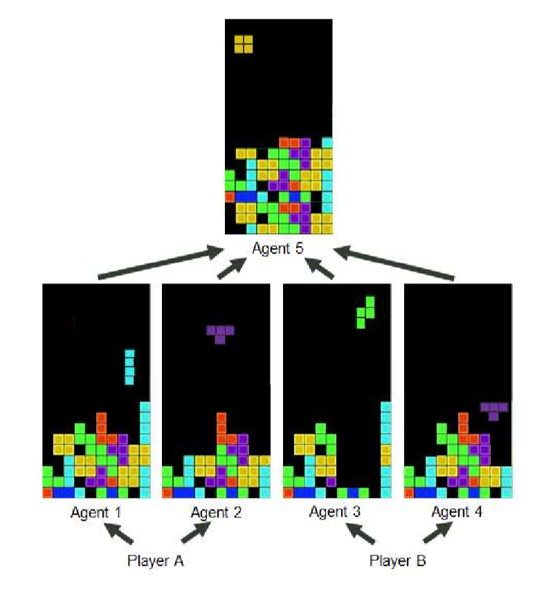

Hybrid Team Tetris
==================

The primary aim of Hybrid Team Tetris is to create hybrid team intelligence within the
envisioned complex problem space described above and to do so in a manner that
makes the platform easily accessible to a broad community of human-centric and
machine intelligence-centric researchers and developers. Hybrid Team Tetris is a
functional multi-agent, multi-human open-source research platform that allows for
users with different knowledge, skills and behaviors to experience key elements of
hybrid team intelligence as outlined below. The intent of the platform is to enable
productive multidisciplinary discussions through the creation of critical technical and
research challenges and ongoing community contributions. While this paper provides
only a brief introduction to Hybrid Team Tetris, downloadable software, as well as, a
description of an upcoming open community Hybrid Team Tetris-based hack-a-thon
(see 'Human System Adaptation Paradigm Challenge 2022') can be found on the
GitHub website as of Jun 17, 2022 (https://github.com/DCSHGAI/HGAITetris).

Why Tetris
----------

While numerous experimental and gaming paradigms could serve as the basis for our
community platform (see ‘Human System Adaptation Paradigm Challenge 2022' for
opportunities to present alternative platforms), the choice to use Tetris as a basis for the
platform arose from three primary reasons:

- Tetris has been successfully deployed as a basic form of hybrid intelligence in
  the past (13, 14)
- Tetris is well-defined and has been used as a platform for both human-centric
  and machine intelligence-centric research and development for over two
  decades (15-17; Current Tetris AI Record set by G Cannon in 2021)
- Tetris offers experimental flexibility and accessibility (for multiple versions and
  configurations see 18-20).

In addition, Tetris is one the of the best-selling games of all time (>100M copies
sold), although we acknowledge that Hybrid Team Tetris has very different game play
than that originally designed by Alexey Pazhitnov in 1984.

Basic Multi-Agent, Multi-Player Gameplay
----------------------------------------

At its core, Hybrid Team Tetris uses a human-guided machine learning approach similar
to Knox & Stone's (13), but updated with Deep TAMER (see 8). That is, as the machine
agent drops a “tetrimino” into a row, a human has an option to press or not press “ENTER”
to indicate what they view as a “positive” move. The Deep TAMER uses the reward
signal to relate the tetrimino shape and dropped position to the state of the game board
and update its game play. This basic mechanism allows humans, who may have no
subject matter expertise in intelligent technologies, to train agents to play the game.

To extend the game to multi-agent, multi-player gameplay, three mechanisms are
employed. First, a single player is presented with multiple games simultaneously. That
is, the player can use keystrokes (“1-2”) to toggle between games and then, press
“ENTER” to indicate a positive move in the selected game. This allows the player to
develop independent agents. Second, a multi-player mode allows additional players to
also play simultaneous games and develop other independent agents, using the
aforementioned mechanism. Third, to develop interactions across the team, additional
games are played by machine agents that learn from all or a sub-set of the player directed
games. This creates agent learning that is dependent on team decisions. A functional
version of the game with 2 players each guiding 2 agents with one dependent agent
learning from the 4 player-guided games is depicted in figure 1 and is located on the
GitHub website (see Base platform).

   
   Basic Hybrid Team Tetris gameplay. Human Player A guides machine Agents 1 & 2. Human
   Player B guides machine Agents 3 & 4. Machine Agent 5 learns from machine Agents 1, 2, 3, and 4.

The number of total numbers of players, agents, and the network interconnectivity
of players and agents can be manipulated to study issues that range from team
collaboration to distributed learning.

Advanced Intelligence Gameplay
------------------------------

A critical challenge for studying future human-technology hybridization is to create a
research environment that is representative of the advances in human and machine
intelligence that do not yet exist. Hybrid Team Tetris approaches this challenge through
the use of “Hidden Rules” that are only initially presented to a single or a sub-set players
or agents. For example, if the “Hidden Rule” is that anytime a row is cleared with >3
yellow squares, a “favorable” tetrimino is presented as the next piece (see Spiel et al
2017 for adapting Tetris difficulty via adjusting the next available Tetrimino) and the
agent receives a “positive” reward even if the human-player does not actively press
“ENTER”. Alternatively, whenever the row with >3 yellow squares is cleared, a
“10*bonus score” could be awarded immediately on screen if the player is being
presented the rule or as an end of game bonus if the agent is being presented the rule. A
functional version of the basic game with the later “Hidden Rule” is located on the
GitHub website (See Advanced_Intelligence platform).